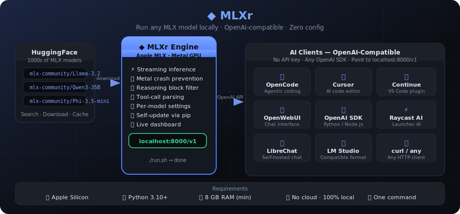
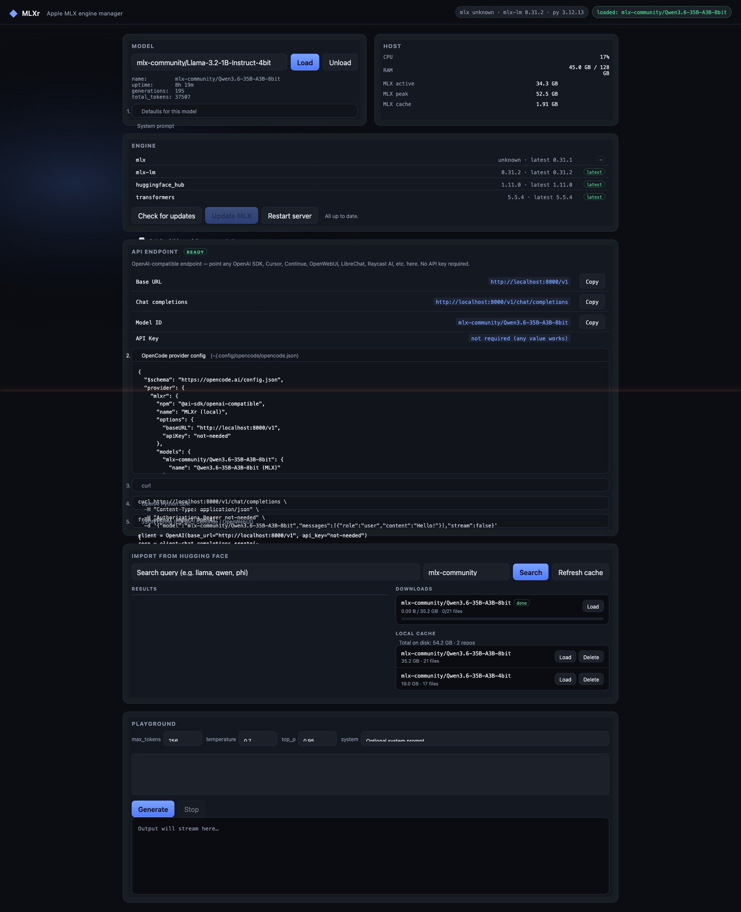

# ◆ MLXr — MLX Model Engine Manager

> The simplest way to run open-source AI models locally on Apple Silicon.  
> One command, a browser dashboard, and an OpenAI-compatible API your existing tools can plug straight into.



---

## What it is

MLXr is a lightweight server + web dashboard that wraps Apple's [MLX](https://github.com/ml-explore/mlx) framework and turns your Mac into a local AI inference engine. Load any model from HuggingFace, interact with it in a built-in playground, and expose it as an OpenAI-compatible API endpoint — all without touching the cloud.



---

## Why MLXr?

| Without MLXr | With MLXr |
|---|---|
| Manual pip installs, Python scripts | `./run.sh` — done |
| No UI — grep logs to see what's loaded | Live dashboard with host stats |
| No API endpoint — can't use existing tools | OpenAI-compatible `/v1/chat/completions` |
| Hunt HuggingFace by hand | Search, download, cache from the dashboard |
| Risk Metal GPU crashes on concurrent use | Inference lock prevents driver segfaults |

---

## Quick start

**Requirements:** Apple Silicon Mac · Python 3.10+ · 8 GB RAM (minimum)

```bash
git clone https://github.com/mchenetz/MLXr
cd MLXr
./run.sh
```

Open **http://localhost:8000** in your browser. That's it.

`run.sh` creates a `.venv`, installs dependencies, and starts the server. On subsequent runs it skips setup and launches immediately.

---

## Features

### 🖥 Dashboard
- Load / unload any HuggingFace MLX model by repo ID
- Live CPU, RAM, and Metal GPU memory meters
- Per-model settings: temperature, top\_p, max\_tokens, system prompt
- Built-in streaming playground — test any model in the browser
- Engine version checker + one-click updater (`pip install --upgrade mlx mlx-lm`)
- Self-restart loop — server updates itself without losing your session

### 📦 HuggingFace browser
- Search the `mlx-community` org (or any author) directly from the dashboard
- One-click download with live progress bar
- Local cache browser — see disk usage, load or delete any downloaded model

### ⚡ OpenAI-compatible API
Point any OpenAI-compatible client at `http://localhost:8000/v1` — no API key required.

| Endpoint | Description |
|---|---|
| `GET /v1/models` | List loaded model |
| `POST /v1/chat/completions` | Streaming & blocking chat |

**Tested with:** OpenCode · Cursor · Continue · OpenWebUI · LibreChat · Raycast AI · OpenAI Python SDK · OpenAI Node SDK · curl

### 🔧 Tool use
Full tool-calling support for agentic workflows. Handles multiple model-specific formats transparently:
- `<tool_call><function=…>` XML (Qwen3, Hermes)
- JSON `{"name": …, "arguments": {…}}` (Qwen2.5, Mistral)
- `[TOOL_CALLS][…]` array (Mistral)
- `<tool_call_begin>…<tool_call_end>` (DeepSeek-V3)

### 🧠 Reasoning model support
Automatically strips `<think>…</think>` chain-of-thought blocks (and `<reasoning>`, `<thinking>`, `<|thinking|>` variants) from responses so OpenAI clients receive clean output. Handles streaming chunk boundaries and stray close tags correctly.

---

## Connect your tools

### OpenCode
Add to `~/.config/opencode/opencode.json`:
```json
{
  "provider": {
    "mlxr": {
      "npm": "@ai-sdk/openai-compatible",
      "name": "MLXr (local)",
      "options": {
        "baseURL": "http://localhost:8000/v1",
        "apiKey": "not-needed"
      }
    }
  }
}
```
The dashboard's **API Endpoint** card generates this config automatically — just copy and paste.

### Cursor / Continue / OpenWebUI
```json
{
  "baseUrl": "http://localhost:8000/v1",
  "apiKey": "anything"
}
```

### Python SDK
```python
from openai import OpenAI

client = OpenAI(base_url="http://localhost:8000/v1", api_key="not-needed")
response = client.chat.completions.create(
    model="mlx-community/Qwen3.6-35B-A3B-8bit",
    messages=[{"role": "user", "content": "Hello!"}],
    stream=True,
)
for chunk in response:
    print(chunk.choices[0].delta.content or "", end="", flush=True)
```

### curl
```bash
curl http://localhost:8000/v1/chat/completions \
  -H "Content-Type: application/json" \
  -d '{
    "model": "mlx-community/Llama-3.2-3B-Instruct-4bit",
    "messages": [{"role": "user", "content": "Hello!"}],
    "stream": true
  }'
```

---

## Configuration

Environment variables:

| Variable | Default | Description |
|---|---|---|
| `MLXR_HOST` | `127.0.0.1` | Bind address (`0.0.0.0` for LAN access) |
| `MLXR_PORT` | `8000` | Port |
| `MLXR_SETTINGS_PATH` | `~/.mlxr/settings.json` | Per-model settings file |

Per-model settings (saved in the dashboard):

| Setting | Description |
|---|---|
| System prompt | Default system message injected when clients don't send one |
| Temperature / top\_p / max\_tokens | Generation defaults |
| Strip thinking | Remove `<think>…</think>` blocks (on by default) |
| Thinking mode | `auto` · `always on` · `always off` |
| Autoload | Load this model automatically on server start |

---

## Architecture

```
Browser / AI client
        │
        ▼
  FastAPI server (server.py)
  ├── GET  /                    → Dashboard (static HTML/CSS/JS)
  ├── POST /api/models/load     → Load MLX model into memory
  ├── POST /api/generate        → Streaming SSE playground
  ├── GET  /v1/models           → OpenAI models list
  ├── POST /v1/chat/completions → OpenAI chat completions (stream + blocking)
  ├── GET  /api/hf/search       → HuggingFace model search
  ├── POST /api/hf/download     → Background snapshot_download
  └── POST /api/engine/upgrade  → pip install --upgrade …
        │
        ▼
  mlx_lm.stream_generate()
  (Apple Metal GPU · single inference lock)
```

---

## Recommended models

All available at [huggingface.co/mlx-community](https://huggingface.co/mlx-community):

| Model | Size on disk | Good for |
|---|---|---|
| `Llama-3.2-1B-Instruct-4bit` | ~0.7 GB | Fast experiments, low RAM |
| `Llama-3.2-3B-Instruct-4bit` | ~1.8 GB | Balanced speed / quality |
| `Qwen2.5-7B-Instruct-4bit` | ~4.3 GB | Strong general assistant |
| `Qwen3.6-35B-A3B-8bit` | ~35 GB | Top-tier, needs 64 GB+ RAM |
| `Mistral-7B-Instruct-v0.3-4bit` | ~4.1 GB | Great instruction following |

---

## License

MIT
